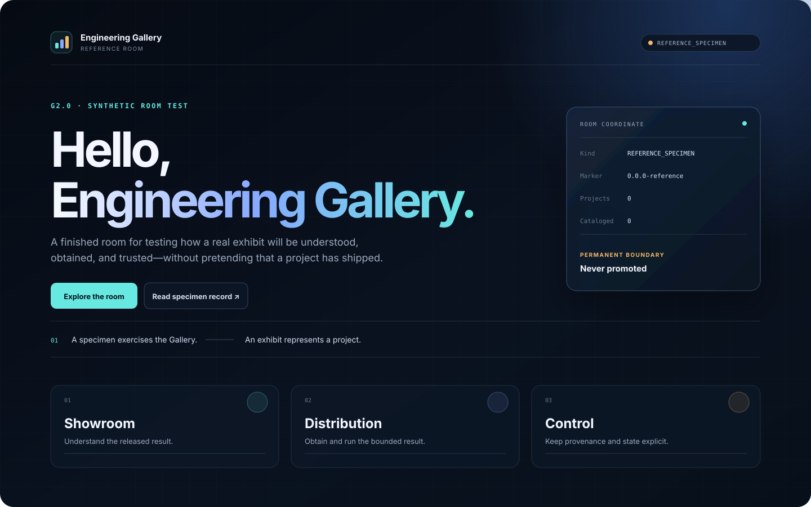
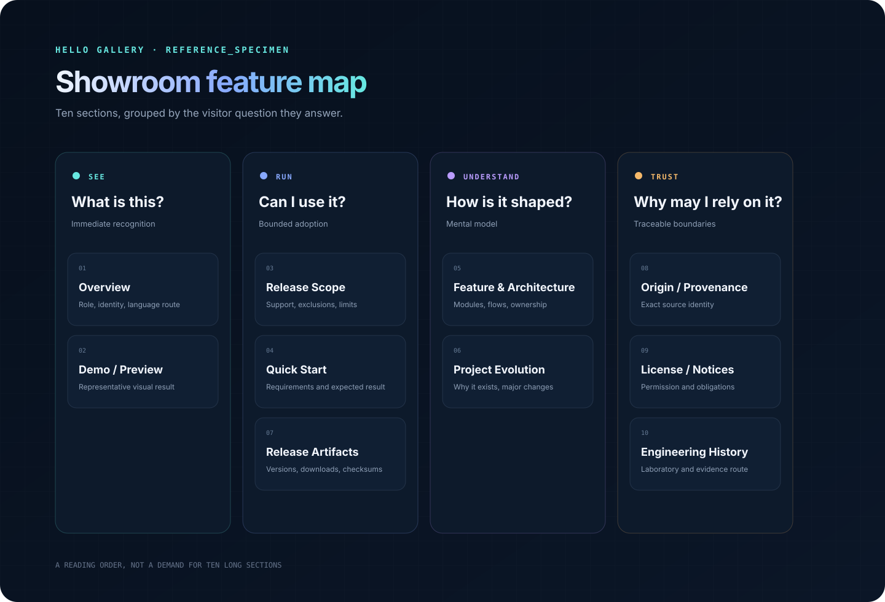
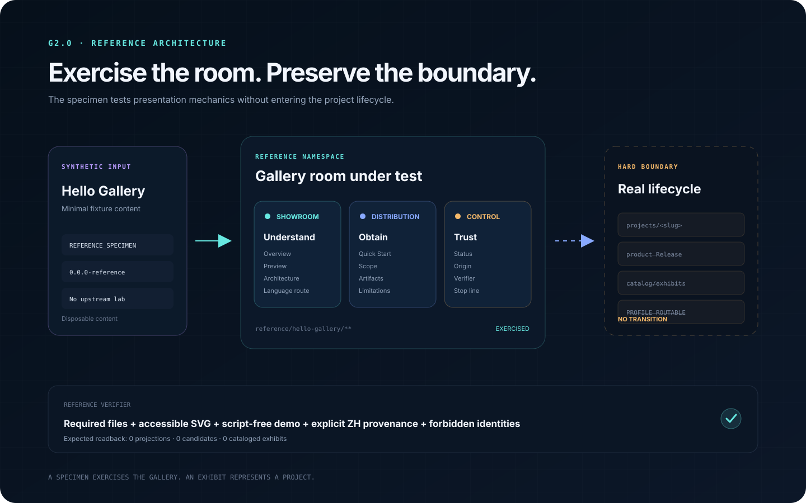

# Hello Gallery

`REFERENCE_SPECIMEN` · `0.0.0-reference` · permanently outside the product catalog

Hello Gallery is a synthetic room test for the public structure of Engineering Gallery. It lets the Gallery validate its reading order, visual density, responsive behavior, provenance display, and language route before any real project is ready.

[Open the local demo](demo/index.html) · [中文说明 / Chinese edition](zh/README.md) · [Read the specimen boundary](../README.md)

[](assets/preview.svg)

[Open the full-size preview](assets/preview.svg)

> **Permanent boundary:** this page is not a software release. It represents 0 project projections and 0 cataloged exhibits. It cannot become `QUALIFIED_FOR_RELEASE`, `RELEASED`, `CATALOGED`, `EN_PROFILE_ROUTABLE`, or `ZH_PROFILE_ROUTABLE`.

## Overview

The specimen answers one design question: can a visitor understand the Gallery, inspect a representative result, find a Quick Start, see the boundary, and trace provenance without being dropped into construction history?

Its content is intentionally small. The room, not the Hello World payload, is what is being exercised.

## Demo / Preview

The script-free [HTML demo](demo/index.html) presents the three Gallery planes:

- **Showroom** helps a visitor understand the released result.
- **Distribution** makes a bounded projection easy to obtain and run.
- **Control** keeps source identity, qualification, release, and routing states separate.

Open `demo/index.html` directly, or follow the local-server option in [Getting Started](docs/getting-started.md). The preview above is a static visual summary of the same specimen.

## Current Release Scope

There is no product release. The reference scope is limited to:

- one responsive, static HTML demo;
- one complete English showroom reading path;
- one local Chinese rendering fixture with explicit source-revision metadata;
- one feature map and one architecture diagram;
- control checks that preserve the permanent non-product state.

It does not include a real project, a real upstream repository, a product tag, a GitHub Release, a catalog record, or either language's Profile route. See [Release Scope](docs/release-scope.md) for the exact boundary.

## Quick Start

No build step or package installation is required.

```text
1. Clone EngineeringGallery.
2. Open reference/hello-gallery/demo/index.html in a modern browser.
3. Confirm the page displays REFERENCE_SPECIMEN and the Showroom, Distribution, and Control cards.
```

For a local HTTP origin, use the optional command in [Getting Started](docs/getting-started.md). The expected result is a responsive static page; it is not evidence that any Gallery project has qualified.

## Feature & Architecture Views

The feature map groups the public reading path by visitor need: see the result, understand the release, and establish trust.

[](assets/diagrams/feature-map.svg)

[Open the full-size feature map](assets/diagrams/feature-map.svg)

The architecture view shows how the specimen exercises the Showroom, Distribution, and Control planes while remaining behind a hard boundary from real projects and catalog state.

[](assets/diagrams/architecture.svg)

[Open the full-size architecture diagram](assets/diagrams/architecture.svg) · [Read the architecture notes](docs/architecture.md)

## Project Evolution

This specimen exists because a Gallery cannot validate its public room with zero content, while unfinished laboratory projects must not be frozen merely to provide sample data.

The solution is a permanent synthetic specimen: it exercises the room now and remains a fixture after real exhibits arrive. It will evolve only when the Gallery presentation contract itself needs to be tested. See [Evolution](docs/evolution.md).

## Release Artifacts

There are no release artifacts, product tags, packages, or checksums for Hello Gallery.

`VERSION` contains `0.0.0-reference` only so the visual treatment of a version coordinate can be exercised. It does not authorize a release and must never appear in the project catalog.

## Origin / Provenance

Hello Gallery is authored inside Engineering Gallery. It has no upstream laboratory and no exported payload.

Its provenance record is [ORIGIN.md](ORIGIN.md). The record names this exact synthetic role instead of inventing an upstream source coordinate.

## License / Notices

The specimen includes [LICENSE.example.md](LICENSE.example.md) and [NOTICE.example.md](NOTICE.example.md) to exercise placement and reading order only.

They are examples, not grants of permission and not a repository-wide license. A real exhibit must resolve its own license and third-party notice obligations before qualification.

## Engineering History

The specimen's design authority is the Gallery's [Exhibit Construction Guide](../../docs/EXHIBIT_CONSTRUCTION_GUIDE.md), especially the reference-specimen boundary.

There is no project laboratory or engineering evidence archive behind this synthetic page. That absence is deliberate and visible.

> A specimen exercises the Gallery. An exhibit represents a project.
